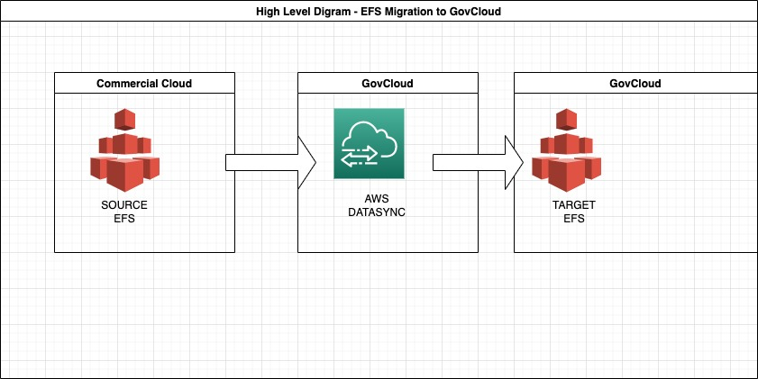

### Here is a diagram of the process of using AWS DataSync to migrate Amazon Elastic File System (EFS) files to AWS GovCloud (US) using AWS icons:




1. Set up a DataSync agent in the GovCloud VPC.
2. Create a DataSync task to transfer the files from the source EFS file system to the target EFS file system.
3. Specify the source and destination locations in the DataSync task.
4. Run the DataSync task to start the data transfer.
```
AWS DataSync will automatically transfer the files from the source EFS file system to the target EFS file system, while minimizing the impact on the source file system and network. You can monitor the progress of the data transfer using the DataSync console or the DataSync API.
```

Reference : https://aws.amazon.com/blogs/publicsector/move-data-in-out-aws-govcloud-datasync/